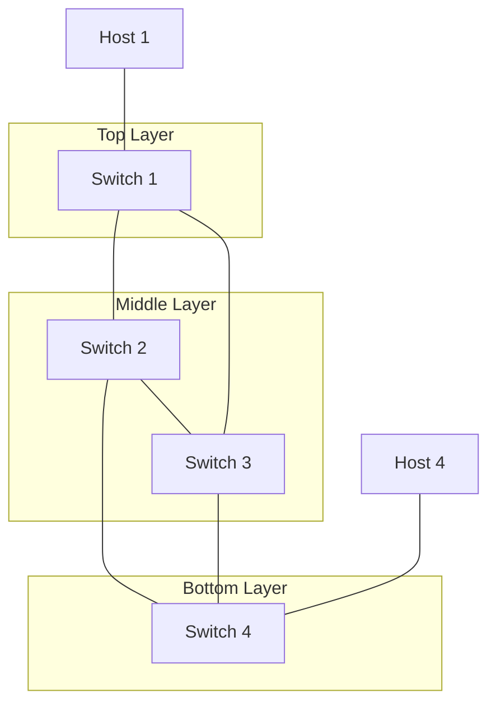

# Phase 2
Contents of phase 2:
- Topology:
  - 4 switch core, layered 1 - 2 - 1, Where each layer can talk to everything 1 layer above / below, each neighbour can talk to each other
  - 4 hosts: 1 host at each end

- SDN:
  - Dynamically path items depending on what links are up and down and depending on what the throughput is

- Learning:
  - Traffic simulation
  - Dynamic ACL adjustments

What will happen: some links will go down, some will go up, but there should almost always be a valid path, if not data shall be uploaded and stored for a bit on the controller, then sent directly to the switch if possible

Need to play around with how the up & down will be handled.

Plan for how the network usually acts:
- The network should be using all switches at max capacity where needed; This means the max throughput overall from h1 - h2 shall be 0.2Mbps
- Where the split isnt required the path will take one route as normal; only when it becomes overloaded shall both switches be used.
- Upon any link failing the SDN shall find a valid path.
- Upon throughput maxing out in the case where a link is up OR down packet loss will be proven inevitable

Items of interest:
- How does a switch tell a link is up or down
- How do we change the ACL based on that
- Does Ryu allow splitting of packets as a default option?
- Packet prioritization

Need to see how to handle ARP properly first,
Need to make sure that h1 and h2 can know of eachother

Prioritise ARP and make sure it doesnt get rebroadcast unless its an arp reply.

NEW:
- WE will do proactive discovery to setup all the ACLs, first LLDP needs to be done, to find adjacent items, so we can set up a neighbour graph.
- Then we put all hosts & services

Steps to implement:
- Network Device discovery: set up links and store the topology
- ARP flood prevention: Check for any loops and turn it into a tree in the ACL, so anything can be reached from anywhere but there shall be no loops
- ARP Host discovery: Upon learning of a host, set up the ACL flow to allow communication, make sure there is no way for loops, though i doubt that should happen, as long as we dont send it back to the place it came from previously
- Packet simulation script: I need a script that will try and max out the link usage.
- Load balancing: Maximising the links usage should be done, at the moment the max of one set of links is .1Mbps, with both set of paths enabled max throughput should be .2Mbps
- Link down recovery: I need to make sure the Controller will dynamically sort out the ACLs for when a link is down, Throughput will tank a hit but is inevitable
- Switch down recovery

Broadcast is determined by the mac address FF:FF:FF:FF:FF:FF, so will check for any spanning tree and set specific rule for that mac address in acl, send to other ports on one switch and drop on rest while making sure all the switches get it