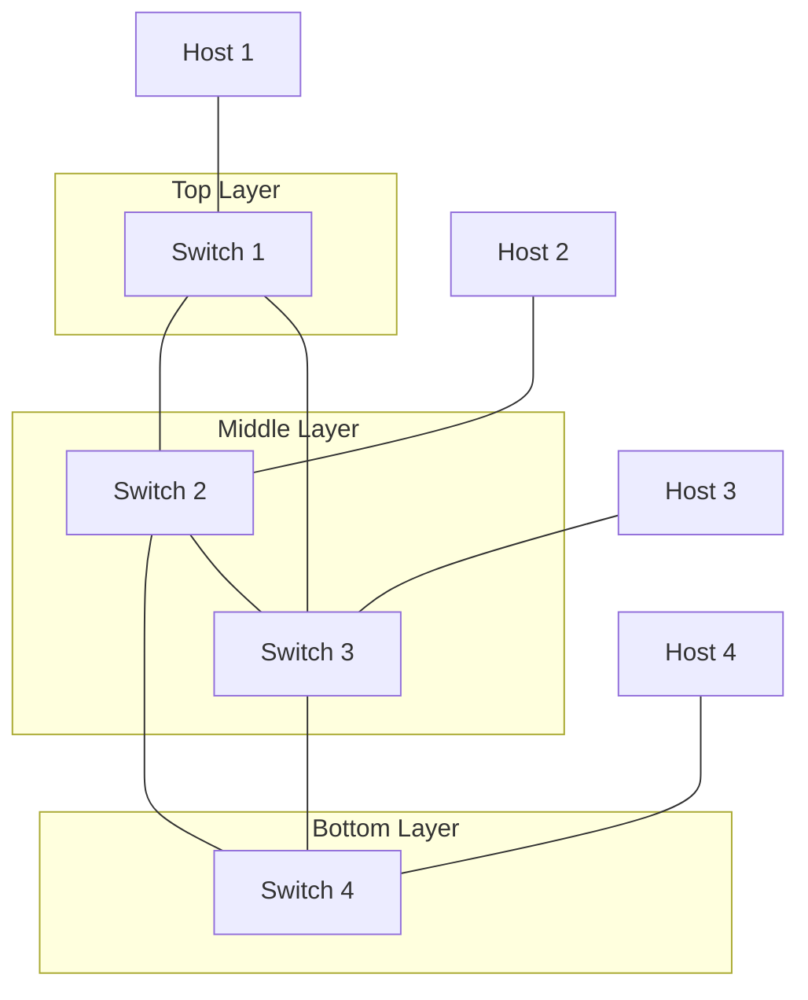

# Phase 2
Contents of phase 2:
- Topology:
  - 4 switch core, layered 1 - 2 - 1, Where each layer can talk to everything 1 layer above / below, each neighbour can talk to each other
  - 4 hosts: 1 host per switch

- SDN:
  - Dynamically path items depending on what links are up and down and depending on what the throughput is

- Learning:
  - Traffic simulation
  - Dynamic ACL adjustments

What will happen: some links will go down, some will go up, but there should almost always be a valid path, if not data shall be uploaded and stored for a bit on the controller, then sent directly to the switch if possible